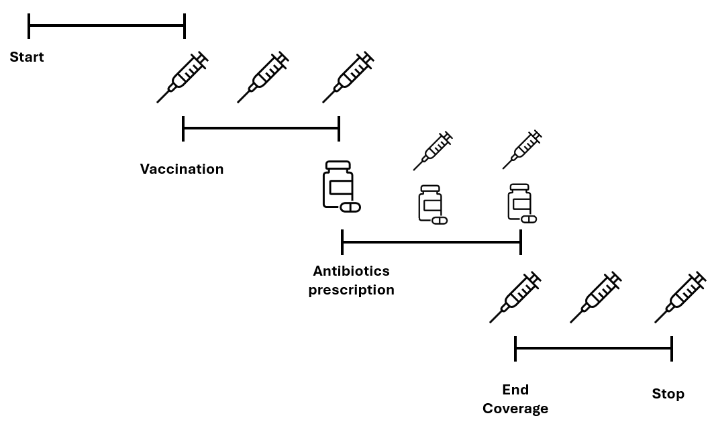

#### Purpose

  
This repository shows how to model time-varying exposures where one of
the two exposures has a limited coverage. In this specific case the
study starts in October, at the beginning of the influential season, and
ends in June at end of spring.  

  
As a result, as the picture shows, once a patient receives the vaccine
it will be effective until the end of the study. On the other hand, if
an antibiotic is prescribed to the patient, its coverage will last only
five days and later the patient will not be exposed to its effect
anymore.  
  


#### Intermittent exposure

  
All dates are turned into the `Date` format; in addition if a missing
value is found for `datedrug`, which means that no antibiotic was
prescribed during the study, the variable `expiredrug` will also have an
`NA`, whereas it will have as value the expiry date of the antibiotic,
which in this case is `datedrug + 5`, as drug’s effect is supposed to
last five days.  

``` r
df=df %>% 
  mutate(across(c(startfu,stopfu,datedrug,datevax),as.Date),
         vax=ifelse(!(is.na(datevax)),
                    1,
                    0)) %>% 
  arrange(id,datevax,datedrug) %>% 
  mutate(expiredrug=as.Date(ifelse(is.na(datedrug),
                              NA,
                              as.Date(datedrug+5))))
```

  
There might be patients that received a second prescription before the
first one expired. In this case the expiry date of the first one becomes
equal to the second expiry date, meaning that the coverage will end five
days after the second prescription.  

``` r
expire=df %>% 
  unique() %>% 
  group_by(id) %>% 
  mutate(expiredrug=as.Date(case_when(lead(datedrug)<=expiredrug~lead(datedrug)+5,
                                         is.na(lead(datedrug)) & lag(expiredrug)<=datedrug~datedrug+5,
                                         T~expiredrug)))
```

  
The dataset is turned into long format to make it easier to wrangle
observations and events that happen for both variables.  

``` r
long=expire %>%
  gather(.,motivation,day,c(startfu,stopfu,
                            datedrug, datevax,
                            expiredrug)) %>% 
  arrange(id,day) %>% 
  filter(!(is.na(day))) %>%  # deletes obs that have NAs because prescription of drug/vax is missing
  unique() %>% # deletes obs that are duplicated because of NAs 
  group_by(id) %>% # groups by patient
  mutate(start=as.numeric(ifelse(row_number()==1, # set start of the study 
                                 0,
                                 day-min(day))),
         stop=as.numeric(lead(day)-min(day))) %>% 
  filter(!(is.na(stop))) %>% 
  mutate(t=row_number(), # set number of obs in time
         vax=ifelse(motivation=='datevax', # sets vax indicator to one if associated that is due to vax
                    1,
                    0),
         drug=NA) %>% # initializes drug indicator to missing
  mutate(stop.lag=lag(stop), # creates variable that will be used to set start and stop times
         start.lag=lag(start),
         stop=ifelse(start==stop,
                     stop+0.1,
                     stop),
         start=case_when(is.na(start.lag)~start,
                         start==start.lag~start+0.1,
                         T~start))
```

  
In the following chunk, indicator for vaccine coverage is set to stay
the same as the one coming before. This is done with a `for` because
`lead` function processes this info simultaneously and not
sequentially.  

``` r
# now switch on vaccine based on the date it happened
for (i in 2:dim(long)[1]){
  long$vax[i]=ifelse(long$vax[i-1]==1 & 
                       long$id[i] == long$id[i-1],
                        1,
                     long$vax[i])
}
```

  
Just like in the chunk before, the indicator for drug is turned on if
the associated date is referred to a drug prescription. Furthermore, the
value remains the same until the loop finds a date  

``` r
# now switch on and off the drug indicator
for (i in 2:dim(long)[1]) {
  long$drug[i]=ifelse(long$motivation[i]=='datedrug',
                      1,
                      0)
  long$drug[i]=case_when(long$id[i]!=long$id[i-1]~0,
                         long$motivation[i] %in% c('datedrug','expiredrug')~long$drug[i],
                         T~long$drug[i-1])
}
```

  
Now the same is done for the indicators that reported a missing value,
which means that the value to be assigned is equal to zero.  

``` r
for (i in 1:dim(long)[1]){
  long$drug[i]=ifelse(is.na(long$drug[i]),
                      0,
                      long$drug[i])
}
# now add event
long=long %>% 
  group_by(id) %>% 
  mutate(tevent=ifelse(row_number()!=n(),
                       0,
                       event)) %>% 
  select(id,start,stop,drug,vax,tevent)
```

  
The restructured dataset looks like the following:  

``` r
print(long[long$id %in% c(1,2,3,4),])
```

    ## # A tibble: 12 × 6
    ## # Groups:   id [4]
    ##       id start  stop  drug   vax tevent
    ##    <dbl> <dbl> <dbl> <dbl> <dbl>  <dbl>
    ##  1     1     0   100     0     0      1
    ##  2     2     0    15     0     0      0
    ##  3     2    15    20     1     0      0
    ##  4     2    20    53     0     0      0
    ##  5     2    53    55     1     0      0
    ##  6     2    55    58     1     1      0
    ##  7     2    58   233     0     1      0
    ##  8     3     0    14     0     0      0
    ##  9     3    14   150     0     1      1
    ## 10     4     0    14     0     0      0
    ## 11     4    14    19     1     0      0
    ## 12     4    19   160     0     0      1
